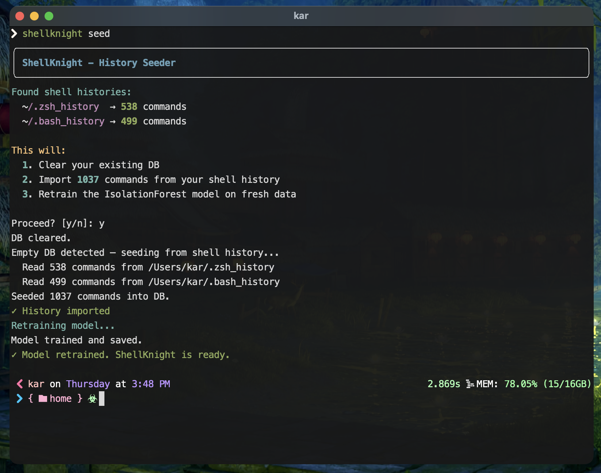
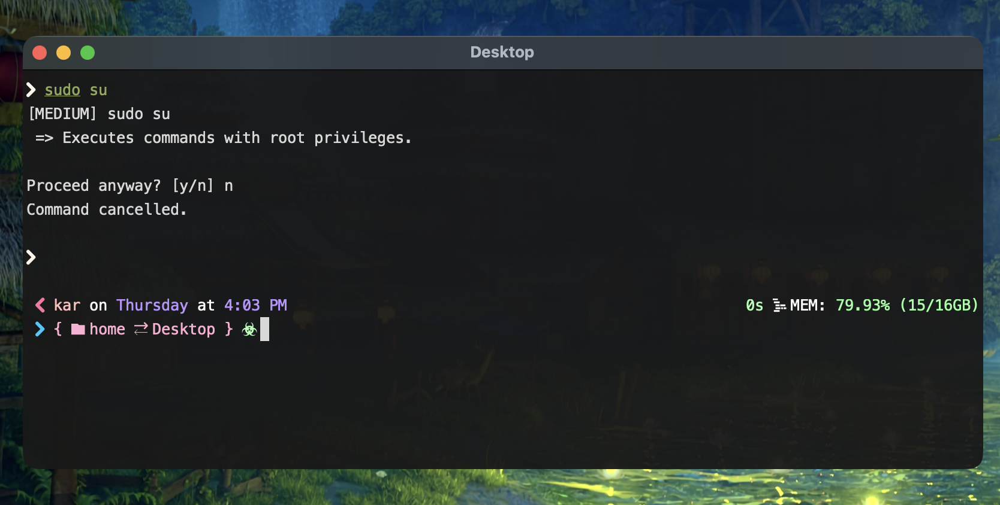
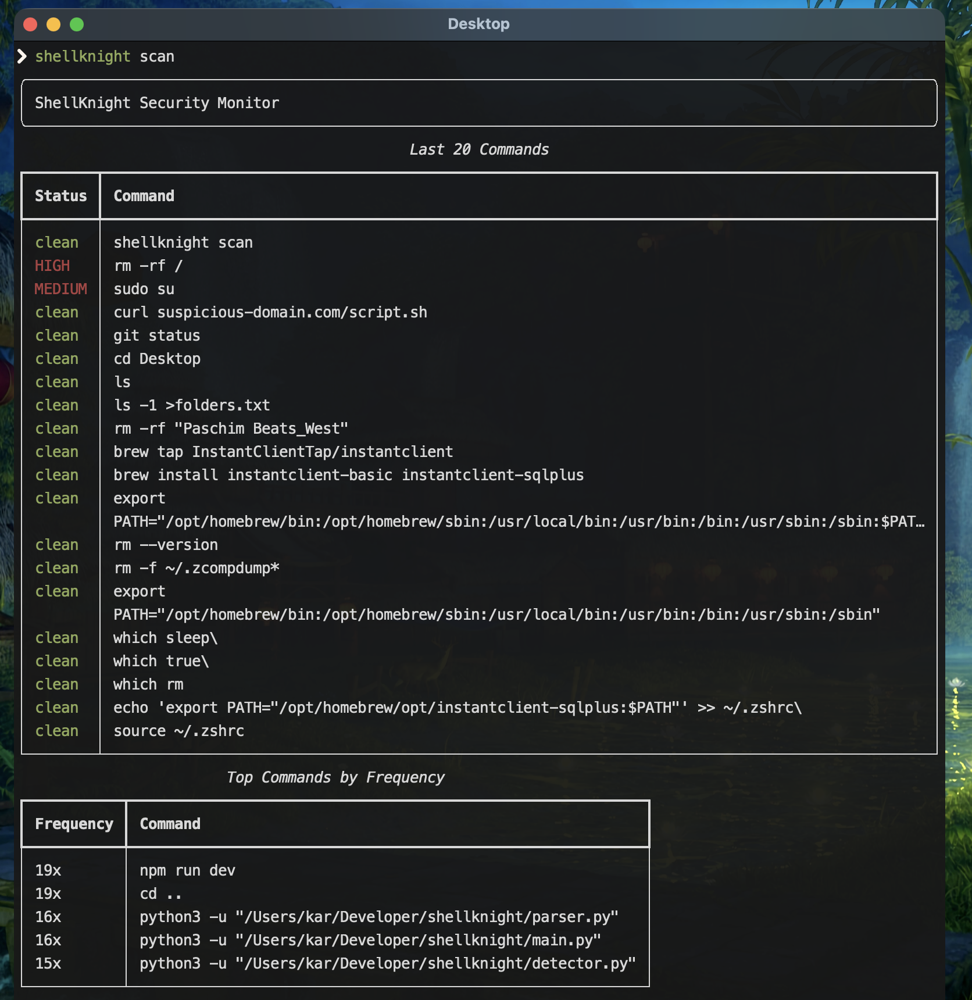
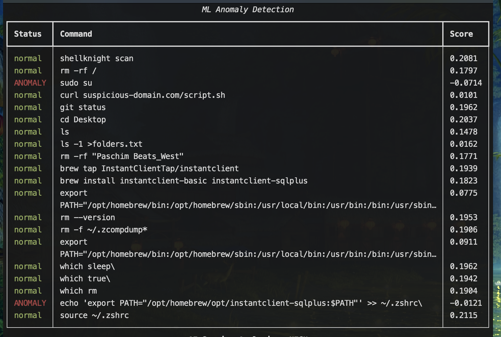
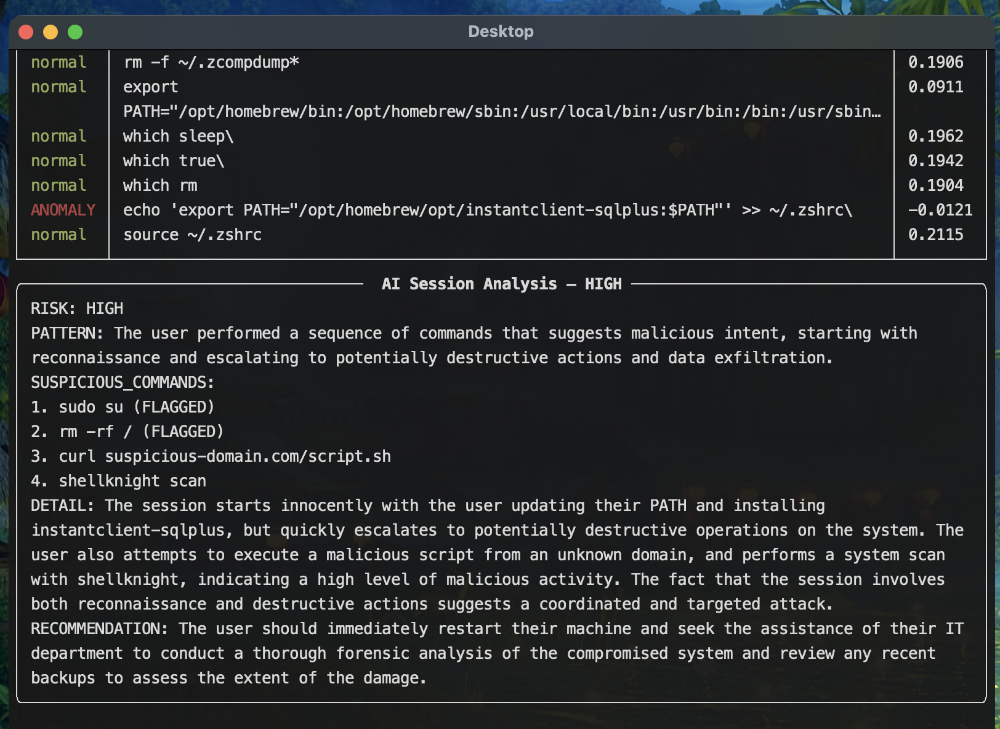
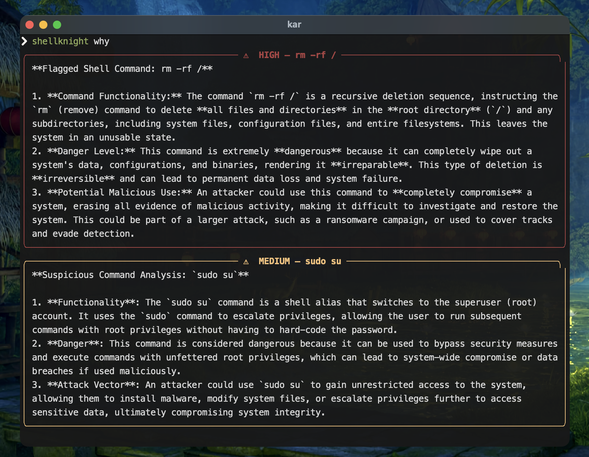

# ShellKnight
### AI-Assisted Terminal Security Monitor

ShellKnight is a personal shell security tool. It monitors your terminal in real time, catches dangerous commands before they execute, and uses machine learning to detect behavioral anomalies specific to *you*.

This is a project I built to understand how real EDR and SIEM pipelines work, how to build modular systems, and how ML fits into a security context. 

---

## What It Does

ShellKnight runs as a pre-exec hook in your zsh shell. Every command you type passes through it before executing. There are three layers of detection:

**Layer 1: Regex Detection (at real-time)**
Catches known dangerous patterns instantly. Reverse shells, `rm -rf /`, base64-encoded payloads, netcat listeners, privilege escalation. If something matches, you get a warning and a yes/no prompt before the command runs.

**Layer 2: ML Anomaly Detection (at scan time)**
An IsolationForest model trained on *your personal shell history*. It's supposed to learn what *your* normal looks like and flags anything that deviates. It's your behavioral profile. 

**Layer 3: AI Session Analysis (at scan time)**
Sends your last 20 commands to Grok (LLaMA 3.1) and asks it to analyze the sequence as a whole story. Since individual commands can look innocent but patterns tell a different story.

---

## Screenshots

### History Seeding & Model Training



ShellKnight imports commands from your shell history and trains a personalized anomaly detection model.

### Real-Time Command Interception



Dangerous commands are intercepted before execution and require explicit confirmation.

### Session Analysis





Recent commands are analyzed using both IsolationForest anomaly detection and AI session analysis.

### AI-Assisted Explanations



Flagged commands can be explained in plain English with context and risk assessment.

---
## How It Works — The Full Pipeline

```
you type a command
        |
zshrc preexec hook fires
        |
guard.py -> regex check (instant)
        |
if flagged -> warn + block
if clean  -> log to SQLite silently
        |
shellknight scan (manual)
        |
ML scoring on last 20 commands
        |
AI session analysis via Grok
        |
rich CLI output with tables + color
```

---

## CLI Commands

```zsh
shellknight scan # ML + AI analysis of your recent session
shellknight why # Grok explains your last 3 flagged commands
shellknight train # retrain the IsolationForest on your current history
shellknight seed # wipe + reseed DB from shell history, then retrain
```

---

## Project Structure

```
shellknight/
├── README.md
├── analyzer.py
├── data/
├── detector.py
├── features.py
├── guard.py
├── logger.py
├── main.py
├── ml_detector.py
├── models/
├── parser.py
├── requirements.txt
├── rules.py
├── shellknight
├── train.py
└── validate_features.py
```

---

## The ML Approach

I chose **unsupervised** over supervised learning since I don't have thousands of labeled "malicious vs benign" commands from my own terminal. I don't think anyone does. So instead of training a classifier on external data, I used IsolationForest which is an anomaly detection algorithm that learns what *normal looks like for me* and flags deviations.

The way IsolationForest works: it builds random decision trees and tries to isolate each point. The anomalies are easy to isolate(only a few cuts are needed). Normal points are hard to isolate (many cuts needed). So the isolation depth becomes the anomaly score.

Each command gets converted into 9 numerical features before hitting the model:

```python
[
  length, # longer cmds = more sus
  hour_of_day, # unusual hrs = sus
  arg_count, # number of command arguments, more arg = more sus
  pipe_count, # chained pipes = sus
  redirect_count, # I/O redirects = sus
  network_risk, # nc=3, nmap=2, curl=1, none=0
  sudo_risk, # sudo su=3, sudo chmod=2, sudo apt=1, none=0
  tmp_flag,  # /tmp/ usage = sus
  command_rarity #self explanatory, more unusual for user = more
]
```

I validated these features against the dtrizna/slp dataset (MIT license) — 12,607 benign commands from NL2Bash and 123 malicious commands from public pentesting resources — before training anything. The validation confirmed the features actually separate malicious from benign:

```
BENIGN (12607 commands)
length: 45.569
hour: 14.000
arg_count: 7.062
pipe_count: 0.545
redirect_count: 0.098
network_risk: 0.050
sudo_risk: 0.025
tmp_flag: 0.017
command_rarity: 0.000

MALICIOUS (123 commands)
length: 82.041
hour: 14.000
arg_count: 9.463
pipe_count: 1.203
redirect_count: 1.098
network_risk: 0.366
sudo_risk: 0.008
tmp_flag: 0.057
command_rarity: 0.000


Feature Separation Analysis

length
  Benign:    45.57
  Malicious: 82.04
  => Malicious commands are ~1.8× longer

arg_count
  Benign:    7.06
  Malicious: 9.46
  =>Malicious commands use more arguments

pipe_count
  Benign:    0.55
  Malicious: 1.20
  => Malicious commands chain more operations

redirect_count
  Benign:    0.10
  Malicious: 1.10
  => Malicious commands use ~11× more redirection

network_risk
  Benign:    0.05
  Malicious: 0.37
  => Malicious commands contain significantly more network activity

tmp_flag
  Benign:    0.017
  Malicious: 0.057
  => /tmp usage is ~3× more common in malicious commands

hour
  => No separation since artificial timestamp

sudo_risk
  => Weak signal in this dataset

command_rarity
  ->  Not evaluated cuz requires user-specific shell history
```

The model is trained on your personal history, not the external dataset. The external dataset was only used to validate that the features carry real signal before trusting them.

---

## The Two-Layer Philosophy

Regex catches what it knows. ML catches what it doesn't.

`rm -rf /` is caught by regex — it's a known signature. The ML model might score it as normal if you run `rm -rf` a lot in your workflow (cleaning build artifacts, deleting project folders). That's correct behavior. The model isn't a malware scanner. It's a behavioral deviation detector.

A command like `nc some-unusual-host.com 4444` at 3am after a series of recon commands — that's what ML catches. No regex rule covers that. The behavioral profile does.

This is the same layered approach real EDR products use: lightweight signature-based detection on the endpoint, heavier behavioral analysis in the backend.

---

## Installation

**Requirements:**
- macOS or Linux
- zsh
- Python 3.8+
- A Groq API key (free at console.groq.com)

**Setup:**

```bash
git clone https://github.com/yourusername/shellknight
cd shellknight
python3 -m venv venv
source venv/bin/activate
pip install -r requirements.txt
```

Add your API key to a `.env` file:

```
GROQ_API_KEY=your_key_here
```

Install the CLI wrapper:
Before installing the launcher script, edit the paths inside `shellknight` to match your local project directory.

```bash
sudo cp shellknight /usr/local/bin/shellknight
sudo chmod +x /usr/local/bin/shellknight
```

Verify installation:
```
shellknight --help
```

Seed the DB and train the model:

```bash
shellknight seed
```

Add the pre-exec hook to your `~/.zshrc`:

```zsh
shellknight_check() {
    local cmd="$1"
    python3 /path/to/shellknight/guard.py "$cmd"
    local risk=$?
    if [[ $risk -eq 1 ]]; then
        echo ""
        read -q "choice?Proceed anyway? [y/n] "
        echo ""
        if [[ "$choice" != "y" ]]; then
            echo "Command cancelled."
            exec zsh
        fi
    fi
}
preexec_functions+=(shellknight_check)
```

Reload your shell:

```bash
source ~/.zshrc
```


---

## Data Attribution

Malicious command dataset: [dtrizna/slp](https://github.com/dtrizna/slp) (MIT License)

Benign command dataset: Lin et al., NL2Bash 2018 (MIT License), via dtrizna/slp

Used only for offline feature validation — not for training the deployed model.

---

## What's Next

`shellknight watch`: background daemon that monitors shell activity and aggregates anomalies into sessions for later analysis
auto-retrain every N commands so the model stays current
process tree analysis: track parent-child relationships, not just individual commands
multi-shell support: bash hook, fish hook
a proper HTML report export

---

## Stack

Python, SQLite, scikit-learn, Groq API (LLaMA 3.1), Rich, zsh preexec hooks
